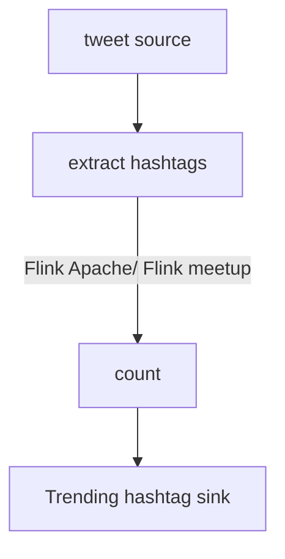

- In many settings, the data is **arriving over time**; it is not received all at once
	- Streaming approaches are designed to process their input *as it is received*
	- Offline or batch processing –> full dataset, all at once


## Streaming Data
- Input elements enter at a rapid rate from **input ports** (ie receiving data form a sensor, from a TCP connection, from a file stream or from a message queue)

1. Elements of the stream are sometimes referred to as *tuples*
2. The stream is potentially infinite
	1. The system cannot store the entire stream accessibly (due to limited memory)

### Example applications
- Data with high volume and constantly arriving over time
	- Sensor data in medical, manufacturing
		- Monitoring 24/7
	- Online customer data
	- Financial transactions, stock trades data

>[!note]
>How to process them in the most efficient way?

---

## Stateful Stream Processing
- Not just perform trivial *record-at-a-time* transformations
	- Process each record one at a time
- **Ability to store and access *intermediate data***
	- How many transactions are already processed
	- State allows recovery (ie continue from record $n$)
	- Each record will only be executed once
- State can be stored and accessed in many different places
	- Streaming process memory
	- Program variables
	- Local files
	- Embedded or external databases

If something happens, recover from the previous state. Each record should only be processed once.

Periodic checkpoint should be stored to a persistent remote storage

---

# Spark

## Micro-batch streaming processing
>[!note]
>Spark does very well on batch processing in a distributed way

Treat the input data as *micro-batch*. Each batch is processed in the Spark cluster in a distributed manner.
*Small, deterministic* tasks generate the output in micro-batches

In the case of failure, revert to the previous batch.

- Process streaming data as a list of micro-batches

---

### Advantages
- Quickly and efficiently recover from failures
- Deterministic nature ensures end-to-end and exactly-once processing guarantees

### Disadvantages
- Latencies of a few seconds (cannot achieve $ms$ latencies)
- Added arbitrary waiting:
	- If record $i$ arrives, need to wait for $n - 1$ other records to arrive before a micro-batch of $n$ is formed and processed
	- Have a tradeoff between latency and performance

---

## Structured Streaming

>[!note] Writing stream processing pipeline should be as easy as writing batch pipelines

Spark does very well for tabular data → treat streaming data as an **unbounded input table**
- no fixed length
- Add new rows on new data

### Advantages
- Can use the batch API for dataframe for stream

## Streaming query


1. Define input sources
2. Transform data
3. Define output sink and output mode
	1. **Output is also a stream**
	2. Write all or just the delta?
4. Specify processing details
	1. How frequently to trigger the process
	2. Determined by the batch size
	3. **Checkpoint location** : stores all the query process info
	4. Records their current state

---

## Data transformation
### Stateless transformation
- Process each row individually without needing any information from previous rows
- Projection operators
- Selection operators


### Stateful transformation
- `df.groupBy().count()`
- Considered a stateful transformation
- Need to communicate current count with the next tuple
- The partial count communicated between plans is the state

**The state is maintained in the ==memory== of Spark executors and is ==checkpointed== (remote storage) to the configured location to tolerate failures**

---
## Stateful streaming aggregations
- Aggregations not based on time
	- Global aggregation
	- Grouped aggregation

```python
runningCount = sensorReadings.groupBy().count()
```

---

## Time semantics
- ==Processing time== : the time of stream processing machine, when data reaches the server
- ==Event time ==: the time an event actually happened

**Event time**
- Decouples processing speed from results
- Operations are predictable and their results are deterministic

For many scenarios, processing time and event time are different.


>[!note] Which time frame should we look at?
>**Processing time** is easy to implement, However,
>- it depends on the current network condition
>- if some faulre happens, restore to the date
> 
> Cannot repeat the operation with exactly the same result.
> Number of packages in the same time window
> 	1. depends on the stream
> 	2. depends on the network condition and other congestions
> 	which cannot be reproduced

**Event time** is deterministic. No matter how many times a stream processing is repeated, I should get exactly the same result.

Assume each event packet has hardcoded timestamp

- Harder to implement but since it is deterministic, it is preferred by streaming processes
- Decouples the processing speed from the results

>[!note] How to determine the end pont. 


## Handling late data with watermarks

```python
(
	 sensorReadings
		 .withWatermark("eventTime", "10 minutes")
		 .groupBy(sensorId, window(eventTime, 10, 5))
		 .count()
)
```

#### References
- [Watermarking structured streaming](https://www.databricks.com/blog/feature-deep-dive-watermarking-apache-spark-structured-streaming)
- [Watermarking in structured streaming II](https://towardsdatascience.com/watermarking-in-spark-structured-streaming-9e164f373e9)

## Performance tuning
- Cluster resource provisioning needs to run 24/7 for stream processing
- Number of partitions for shuffles to be set much lower than batch queries
- Setting source rate limits for stability
	- Limit the events emitted by the source
	- Might need queue or buffer
- Multiple streaming queries in the same Spark application

---

# Flink
- Native stream processing

## Event-driven streaming application
If there are a lot of streaming data, use event log application such as Kafka.


- Event log — can walk back to checkpoint to resend the event
	- Decouples sender and receiver
	- Provide async, nonblocking event transfer
	- No need to worry about the downstream processes’ rate limits

## Dataflow model

>[!note] Similar to DAG

### Dataflow graph
A logical dataflow graph
- Nodes represent operators / tasks
- edges denote data dependencies



## Architecture

>[!note]
>Flink is a distributed system for *stateful* *parallel* data stream processing


### `TaskManager`
- Offers a certain number of processing slots to control the number of tasks it is able to concurrently execute

### Slot
- Can execute one *slice* of an application — one parallel task of each operator of the application

### Task Execution

In a dataflow graph, for each node, you can allocate multiple slots


Number of slots can be configured based on the load of the tasks. The `TaskManager` can execute several tasks in parallel:
- tasks of the same operator (data parallelism)
- tasks of different operators (task parallelism)
- tasks from different applications (job parallelism)

---

## Data transfer
>[!note]
>Even though Flink does not have micro-batch, it does not mean that it operates as soon as a new record arrives. It uses a buffer.
>
>The buffer is managed at the `node` level.
>
>The `node` does not have to synchronise.

---

## Event-time processing

### Timestamps
- Every record must be accompanied by an event timestamp

### Watermarks
- A Flink event-time application must also provide watermarks
- Watermarks are used to derive the current event time at each task in an event-time application
- **Special record** holding a timestamp as a `long` value
- Flows in a stream of regular records with annotated timestamps


`watermark = 5` implies that all the event happened event time = 5 has been received and you can trigger some output if you want.

>[!note]
>Watermark tells us if we have all the event before a watermark $n$

---

## State management


### How do they `checkpoint`?
- Uses a special record

---

# Stop-the-world checkpoints

---

# Spark vs Flink

